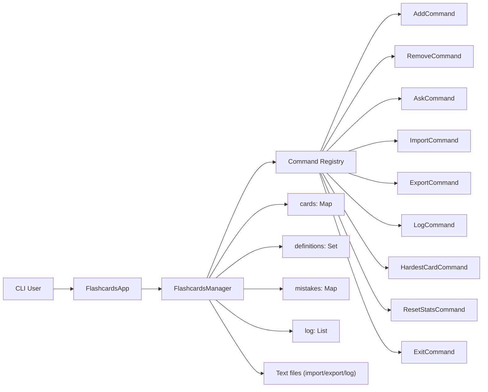

# Flashcards App - Production-Style CLI Learning Tool

A command-driven Java application for managing flashcards, tracking mistakes, and running quiz sessions.
It demonstrates stateful CLI architecture, command pattern usage, persistence flows, and user-session logging.

## Highlights

- Command-based CLI architecture with pluggable actions (`add`, `remove`, `import`, `export`, `ask`, `log`, `hardest card`, `reset stats`, `exit`)
- In-memory domain model for cards, unique definitions, and per-card mistake counters
- File import/export with override behavior for existing terms
- Session transcript logging to file for reproducible debugging
- Automated startup/shutdown data handling via `-import` and `-export` arguments
- Feedback-rich quiz mode with support for "definition belongs to another card" hints

## Architecture



### How it works (high level)

- `FlashcardsApp` initializes `FlashcardsManager` and starts an input loop.
- `FlashcardsManager` maps user actions to command objects through a command registry.
- Commands delegate core operations back to manager methods (add/remove/quiz/import/export/logging/statistics).
- Card state and mistake counters are kept in memory and optionally synchronized with files.
- Import/export CLI args handle automatic load on startup and save on exit.

## Engineering Challenges

- Keeping command handlers cohesive while reusing shared state safely
- Enforcing uniqueness for both terms and definitions
- Preserving deterministic user feedback and session logs for every interaction
- Handling persistence edge cases (missing files, parse errors, overwrite semantics)

## My Contribution

- Implemented command-driven orchestration around `FlashcardsManager`.
- Added card lifecycle actions and quiz flow with detailed correctness feedback.
- Implemented import/export persistence including replacement behavior for existing terms.
- Added mistake analytics (`hardest card`) and reset mechanics.
- Implemented full session logging and CLI startup/shutdown file automation.

## Tech Stack

- **Language:** Java 17
- **Paradigm:** Object-oriented CLI with Command pattern
- **Persistence:** Plain text files (`import`, `export`, `log`)
- **Build/Run:** `javac` / `java`

## Quick Start

### Prerequisites

- Java 17+

### Compile and run

```bash
git clone https://github.com/DiacencoDumitru/flashcards-app.git
cd flashcards-app
javac -d out $(find src -name "*.java")
java -cp out flashcards.FlashcardsApp
```

Run with startup/shutdown persistence:

```bash
java -cp out flashcards.FlashcardsApp -import cards.txt -export cards.txt
```

## How to Verify

```bash
# compile
javac -d out $(find src -name "*.java")

# run app and manually execute:
# add -> ask -> hardest card -> reset stats -> export -> exit
java -cp out flashcards.FlashcardsApp

# run with automated import/export args
java -cp out flashcards.FlashcardsApp -import cards.txt -export cards.txt
```

## CLI Commands

- `add` - create a card with unique term and definition
- `remove` - delete a card by term
- `import` - load cards from file
- `export` - save cards to file
- `ask` - run quiz prompts
- `log` - save full session dialogue to file
- `hardest card` - show cards with max mistakes
- `reset stats` - clear mistake counters
- `exit` - terminate application (and apply `-export` if configured)

## Why This Project

This project demonstrates practical backend-oriented fundamentals in a CLI context:

- state management and command dispatch
- persistence and recovery workflows
- user-facing validation and error feedback
- maintainable separation between orchestration and actions

## Project Structure

- `src/flashcards` - application entry and manager/orchestration
- `src/command` - command implementations and command interface
- `README.md` - project documentation

## Author

Dumitru Diacenco, Java Backend Engineer